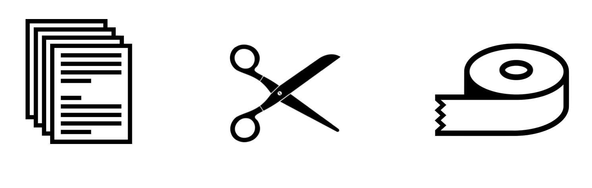
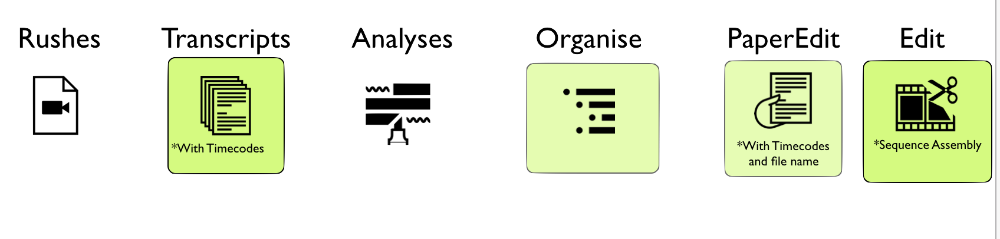
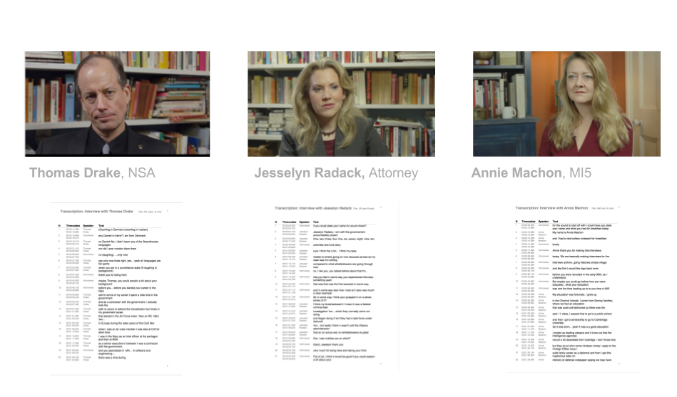
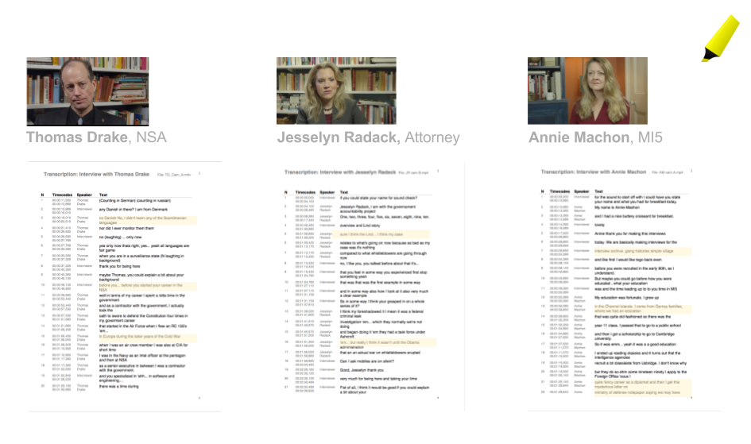
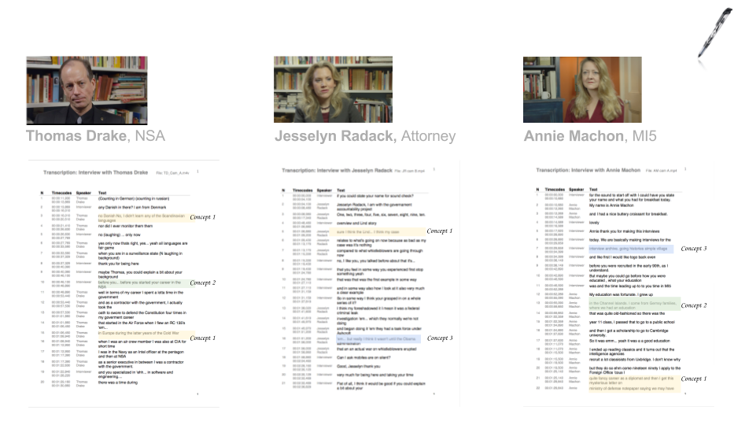
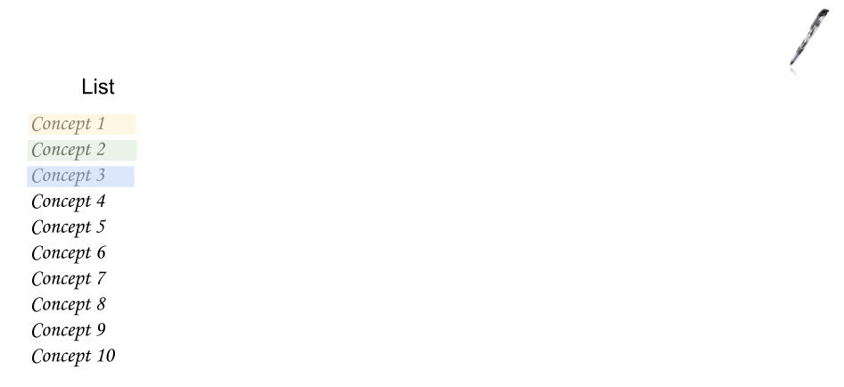
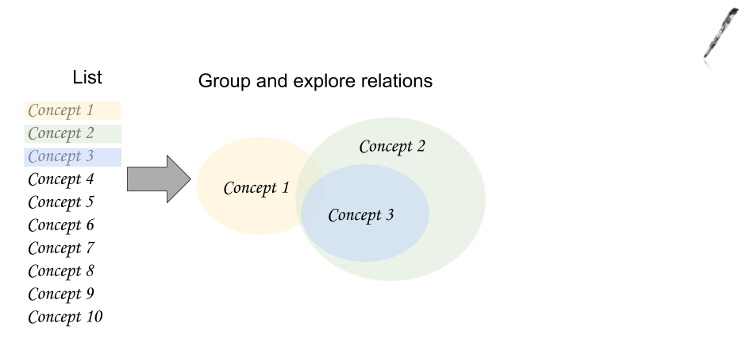
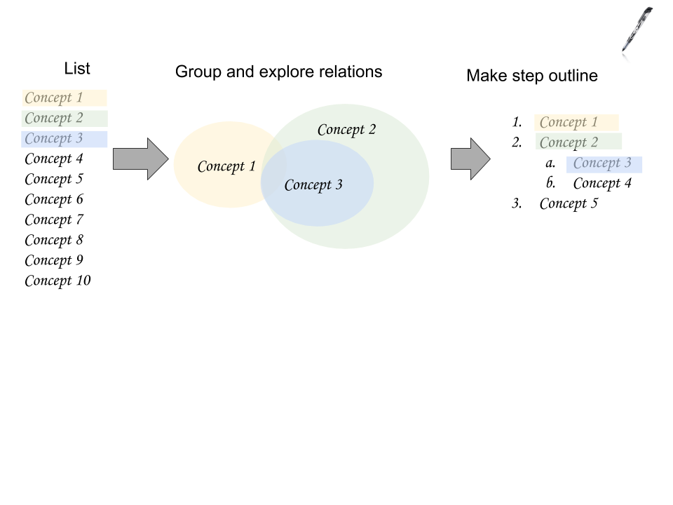
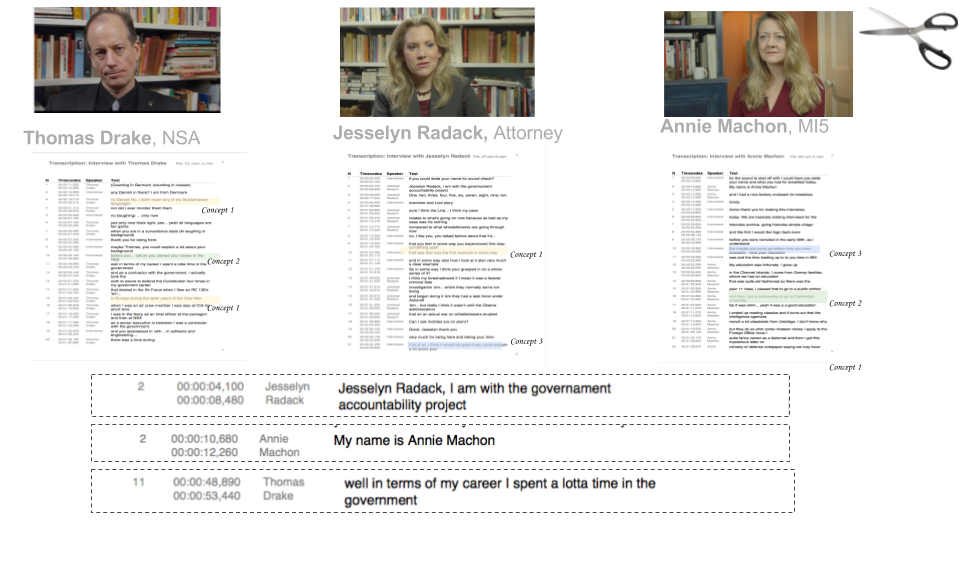
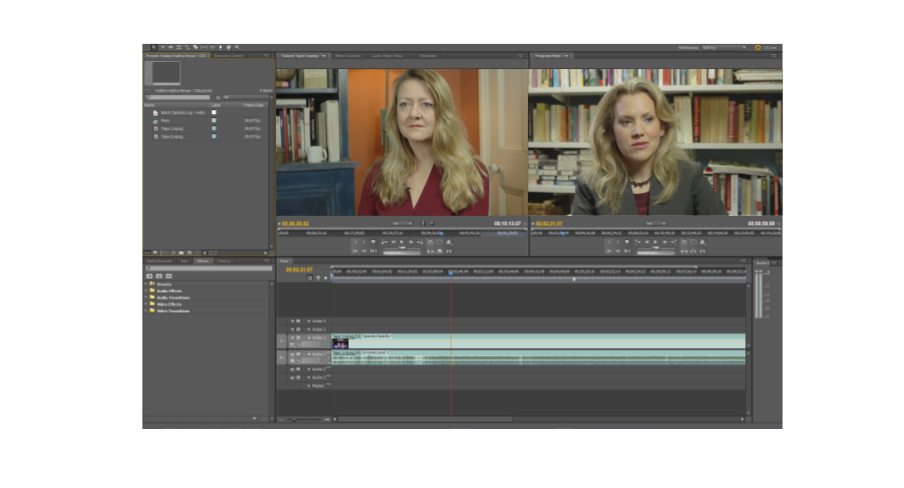

# Paper-editing overview

In a paper-editing workflow, at a high level, you would do the following.

## 1. Timecoded Transcription

You'd get a timecoded transcription of the video interviews

Let's see this step by step.

## 2. Read

Read it through a first time

## 3. hilight what stands out

Read a second time, with a hilighter and mark things that stands out at a gut feeling level.

## 4. Identify Themes and ideas

Look through a third time to identify themes and ideas that could be group together, from the parts you have identified.

## 4. list the themes

Make a list of the themes you have identified in each interview.

## 5. explore relations

Think about how the themes relate to each other

## 6. Make high level outline

Make an outline of these highl level themes, selecting the most significant.

## 7. Fill in the dialogue

Fill in the dialogue, find the text in the transcription for each theme in the outline, and add it to the outline. Will come back to this point an thing about story concept that can be used to strengthen the narrative. Such as expositon.

add text selection to timeline

## 8. Recconect video sequence

Using the timecodes and file reference in the paper-edit reconnect the video sequence in the video editing software of choice.

